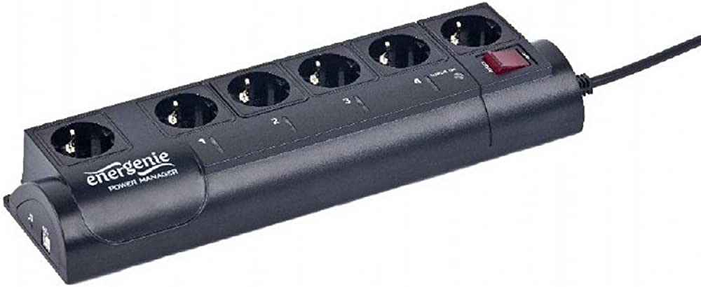

EG-PMS2
=======

Simple driver to control EG-PMS2 surge protector with power management implemented
in Rust. The whole implemnetation is done in user-land. (Works on FreeBSD)



# Build
```
$ cargo build -r
```

# Usage

* Get status of sockets:
```
$ egpms status
```

* Get status of single socket:
```
./egpms status 1
```

* Enable socket:
```
./egpms enable 1

```

* Disable socket:
```
./egpms disable 1
```

# Config file

The tool can be configured to assign names to socket representations.
To do this, create a `.egpms.toml` file in your `$HOME` directory:

```toml
[config]

[[sockets]]
socket_id = 1
name = "tv"

[[sockets]]
socket_id = 2
name = "pralka"
```

# ToDo

- [ ] support multiple devices

# Author

Mariusz Zaborski <mariusz@zaborski.pl>

# License

BSD-2-Clause-FreeBSD
